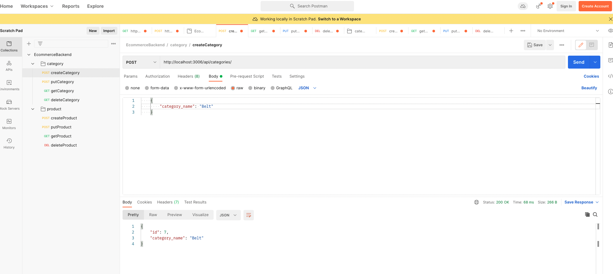

# E-commerce Back End Starter Code

# # Description

AS A developer
I WANT to be able to develop the relationships and routes for the ecommerce project
SO THAT I can develop the front end and connect the code for ecommerce project

## Screenshot

## GitHub Repo

https://github.com/RekhaLeelara/E-CommerceBackend

## Video Walkthrough

https://drive.google.com/drive/folders/1YK1wm8a_94JniBnXKRlSObI2GlCeW8tw

## Built With

Node JS
Express
MySQL Javascript
Postman
Sequelize

## Usage

Go to the terminal > npm start
Go to Postman and enter routes based upon GET, POST, PUT or DELETE
And the respective data should be returned based on the user input

## Support

N/A

## Roadmap

Build front-end and integrate the code

## License

N/A

## Project Status

Baseline project completed. Additional enhancements can be done based on the user feedback.

